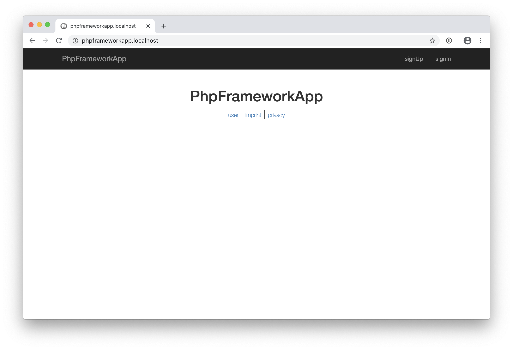

# PhpFrameworkApp

This repository is a skeleton app for the PhpFramework.

## Install

- clone this repository
- remove the .git dir
- rename config/_config.php to config/config.php
- setup your database connection at config/config.php
- $ composer install
- install node.js
- $ npm install --global gulp-cli
- $ npm install
- $ gulp
- $ ./robin migration -m
